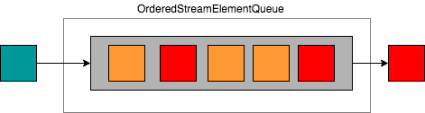
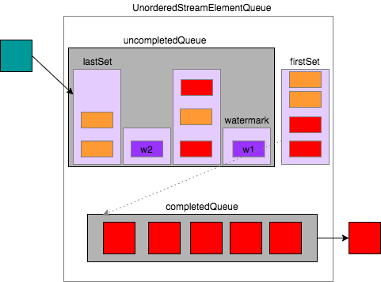

# 异步IO
异步调用相比于同步调用，不同请求的等待时间可以重叠，从而提升了吞吐率。
## Async I/O的使用方式
在Flink中使用Async I/O需要一个支持异步请求的客户端。以[官方链接](https://ci.apache.org/projects/flink/flink-docs-master/dev/stream/operators/asyncio.html)为例：
```scala
/**
 * An implementation of the 'AsyncFunction' that sends request and sets the callback.
 */
class AsyncDatabaseRequest extends AsyncFunction[String, (String, String)] {
    /** The database specific client that can issue concurrent requests with callbacks */
    lazy val client: DatabaseClient = new DatabaseClient(host, post, credentials)
    /** The context used for the future callbacks */
    implicit lazy val executor: ExecutionContext = ExecutionContext.fromExecutor(Executors.directExecutor())

    override def asyncInvoke(str: String, resultFuture: ResultFuture[(String, String)]): Unit = {
        // issue the asynchronous request, receive a future for the result
        // 发起异步请求，返回结果是一个Future
        val resultFutureRequested: Future[String] = client.query(str)
        // set the callback to be executed once the request by the client is complete
        // the callback simply forwards the result to the result future
        // 请求完成时的回调，将结果交给ResultFuture
        resultFutureRequested.onSuccess {
            case result: String => resultFuture.complete(Iterable((str, result)))
        }
    }
}

// create the original stream
val stream: DataStream[String] = ...
// 应用async I/O转换，设置等待模式、超时时间、以及进行中的异步请求的最大数量
val resultStream: DataStream[(String, String)] = 
    AsyncDataStream.unorderedWait(stream, new AsyncDatabaseRequest(), 1000, TimeUnit.MILLISECONDS, 100)
```
AsyncDataStream提供了两种调用方法，分别是orderedWait和unorderedWait，分别对应了有序和无序两种输出模式。之所以会提供两种输出模式，是因为异步请求的完成时间是不确定的，先发出的请求的完成时间可能会晚于后发出的请求。在“有序”的输出模式下，所有计算结果的提交完全和消息的到达顺序一致；而在“无序”的输出模式下，计算结果的提交则是和请求的完成顺序相关的，先处理完成的请求的计算结果会先提交。值得注意的是，在使用“事件时间”的情况下，“无序”输出模式仍然可以保证watermark的正常处理，即在两个watermark之间的消息的异步请求结果可能是异步提交的，但在watermark之后的消息不能先于该watermark之前的消息提交。

由于异步请求的完成时间不确定，需要设置请求的超时时间，并配置同时进行中的异步请求的最大数量。
## Async I/O的实现
AsyncDataStream在运行时被转换为AsyncWaitOperator算子，它是AbstractUdfStreamOperator的子类。下面看看AsyncWaitOperator的实现原理。
### 基本原理
AsyncWaitOperator算子相比于其他算子的最大不同在于，它的输入和输出并不是同步的。因此，在AsyncWaitOperator内部采用了一种“生产者-消费者”模型，基于一个队列解耦异步计算和计算结果的提交。StreamElementQueue提供了一种队列的抽象，一个“消费者”线程Emitter从中取出已完成的计算结果，并提交给下游算子，而异步请求则充当了队列“生产者”的角色。基本的处理逻辑如下图所示。
::: hljs-center


:::

```java
public class AsyncWaitOperator<IN, OUT>
        extends AbstractUdfStreamOperator<OUT, AsyncFunction<IN, OUT>>
        implements OneInputStreamOperator<IN, OUT>, BoundedOneInput {
    /** Queue, into which to store the currently in-flight stream elements. */
    private transient StreamElementQueue<OUT> queue;

    public void processElement(StreamRecord<IN> element) throws Exception {
        // add element first to the queue
        final ResultFuture<OUT> entry = addToWorkQueue(element);

        final ResultHandler resultHandler = new ResultHandler(element, entry);

        // register a timeout for the entry if timeout is configured
        // 注册一个定时器，在超时时调用timeout方法
        if (timeout > 0L) {
            final long timeoutTimestamp = timeout + getProcessingTimeService().getCurrentProcessingTime();

            final ScheduledFuture<?> timeoutTimer = getProcessingTimeService().registerTimer(
                timeoutTimestamp,
                timestamp -> userFunction.timeout(element.getValue(), resultHandler));

            resultHandler.setTimeoutTimer(timeoutTimer);
        }

        userFunction.asyncInvoke(element.getValue(), resultHandler);
    }

    /**
     * Add the given stream element to the operator's stream element queue. This operation blocks until the element
     * has been added.
     *
     * <p>Between two insertion attempts, this method yields the execution to the mailbox, such that events as well
     * as asynchronous results can be processed.
     *
     * @param streamElement to add to the operator's queue
     * @throws InterruptedException if the current thread has been interrupted while yielding to mailbox
     * @return a handle that allows to set the result of the async computation for the given element.
     */
    private ResultFuture<OUT> addToWorkQueue(StreamElement streamElement) throws InterruptedException {

        Optional<ResultFuture<OUT>> queueEntry;
        while (!(queueEntry = queue.tryPut(streamElement)).isPresent()) {
            mailboxExecutor.yield();
        }

        return queueEntry.get();
    }

    /**
     * Outputs one completed element. Watermarks are always completed if it's their turn to be processed.
     *
     * <p>This method will be called from {@link #processWatermark(Watermark)} and from a mail processing the result
     * of an async function call.
     */
    private void outputCompletedElement() {
        if (queue.hasCompletedElements()) {
            // emit only one element to not block the mailbox thread unnecessarily
            queue.emitCompletedElement(timestampedCollector);
            // if there are more completed elements, emit them with subsequent mails
            if (queue.hasCompletedElements()) {
                mailboxExecutor.execute(this::outputCompletedElement, "AsyncWaitOperator#outputCompletedElement");
            }
        }
    }
}
```
AsyncWaitOperator可以工作在两种模式下，即ORDERED和UNORDERED。Flink通过StreamElementQueue的不同实现对应了这两种模式。
### “有序”模式
在“有序”模式下，所有异步请求的结果必须按照消息的到达顺序提交到下游算子。在这种模式下，StreamElementQueue的具体实现是OrderedStreamElementQueue。OrderedStreamElementQueue的底层是一个有界的队列，异步请求的计算结果按顺序加入到队列中，只有队列头部的异步请求完成后才可以从队列中获取计算结果。
::: hljs-center



:::
```java
public final class OrderedStreamElementQueue<OUT> implements StreamElementQueue<OUT> {
    /** Capacity of this queue. */
    private final int capacity;

    /** Queue for the inserted StreamElementQueueEntries. */
    private final Queue<StreamElementQueueEntry<OUT>> queue;

    public OrderedStreamElementQueue(int capacity) {
        Preconditions.checkArgument(capacity > 0, "The capacity must be larger than 0.");

        this.capacity = capacity;
        this.queue = new ArrayDeque<>(capacity);
    }

    @Override
    public boolean hasCompletedElements() {
        return !queue.isEmpty() && queue.peek().isDone();
    }

    @Override
    public void emitCompletedElement(TimestampedCollector<OUT> output) {
        if (hasCompletedElements()) {
            final StreamElementQueueEntry<OUT> head = queue.poll();
            head.emitResult(output);
        }
    }

    @Override
    public List<StreamElement> values() {
        List<StreamElement> list = new ArrayList<>(this.queue.size());
        for (StreamElementQueueEntry e : queue) {
            list.add(e.getInputElement());
        }
        return list;
    }

    @Override
    public boolean isEmpty() {
        return queue.isEmpty();
    }

    @Override
    public int size() {
        return queue.size();
    }

    @Override
    public Optional<ResultFuture<OUT>> tryPut(StreamElement streamElement) {
        if (queue.size() < capacity) { // 未达容量上限
            StreamElementQueueEntry<OUT> queueEntry = createEntry(streamElement);

            queue.add(queueEntry);

            LOG.debug("Put element into ordered stream element queue. New filling degree " +
                "({}/{}).", queue.size(), capacity);

            return Optional.of(queueEntry);
        } else {
            LOG.debug("Failed to put element into ordered stream element queue because it " +
                "was full ({}/{}).", queue.size(), capacity);

            return Optional.empty();
        }
    }

    private StreamElementQueueEntry<OUT> createEntry(StreamElement streamElement) {
        if (streamElement.isRecord()) {
            return new StreamRecordQueueEntry<>((StreamRecord<?>) streamElement);
        }
        if (streamElement.isWatermark()) {
            return new WatermarkQueueEntry<>((Watermark) streamElement);
        }
        throw new UnsupportedOperationException("Cannot enqueue " + streamElement);
    }
}
```
### “无序”模式
在“无序”模式下，异步计算结果的提交不是由消息到达的顺序确定的，而是取决于异步请求的完成顺序。当然，在使用“事件时间”的情况下，要保证watermark语义的正确性。在使用“处理时间”的情况下，由于不存在Watermark，因此可以看做一种特殊的情况。在UnorderedStreamElementQueue中巧妙地实现了这两种情况。
::: hljs-center



:::
从上图中可以看出，在UnorderedStreamElementQueue内部使用了两个队列，ArrayDeque&lt;Set&lt;StreamElementQueueEntry&lt;?&gt;&gt;&gt; uncompletedQueue中保存未完成的异步请求计算结果，而completedQueue中保存已完成的异步请求计算结果。注意，ArrayDeque&lt;Set&lt;StreamElementQueueEntry&lt;?&gt;&gt;&gt; uncompletedQueue这个队列中的元素是异步请求计算结果的散列集合，从图中也可以看出，watermarkSet作为一种特殊的集合，其内部只有一个元素，即Watermark，充当了不同散列集合之间的分界。这样就保证了在一个Watermark之后的异步请求的计算结果不会先于该Watermark之前进行提交。firstSet中完成异步请求的计算结果会被转移到completedQueue队列中，firstSet内部的所有异步请求的计算结果都是可以乱序提交的。

如果不使用“事件时间”，那么没有Watermark产生，所有的异步请求都会进入firstSet中，因而所有的结果都是乱序提交的。

具体代码实现逻辑如下，结合上面的示意图应该不难理解。
```java
public final class UnorderedStreamElementQueue<OUT> implements StreamElementQueue<OUT> {
    /** Capacity of this queue. */
    private final int capacity;

    /** Queue of queue entries segmented by watermarks. */
    private final Deque<Segment<OUT>> segments;

    private int numberOfEntries;

    public UnorderedStreamElementQueue(int capacity) {
        Preconditions.checkArgument(capacity > 0, "The capacity must be larger than 0.");

        this.capacity = capacity;
        // most likely scenario are 4 segments <elements, watermark, elements, watermark>
        this.segments = new ArrayDeque<>(4);
        this.numberOfEntries = 0;
    }

    @Override
    public Optional<ResultFuture<OUT>> tryPut(StreamElement streamElement) {
        if (size() < capacity) {
            StreamElementQueueEntry<OUT> queueEntry;
            if (streamElement.isRecord()) {
                queueEntry = addRecord((StreamRecord<?>) streamElement);
            } else if (streamElement.isWatermark()) {
                queueEntry = addWatermark((Watermark) streamElement);
            } else {
                throw new UnsupportedOperationException("Cannot enqueue " + streamElement);
            }

            numberOfEntries++;

            LOG.debug("Put element into unordered stream element queue. New filling degree " +
                    "({}/{}).", size(), capacity);

            return Optional.of(queueEntry);
        } else {
            LOG.debug("Failed to put element into unordered stream element queue because it " +
                    "was full ({}/{}).", size(), capacity);

            return Optional.empty();
        }
    }

    private StreamElementQueueEntry<OUT> addRecord(StreamRecord<?> record) {
        // ensure that there is at least one segment
        Segment<OUT> lastSegment;
        if (segments.isEmpty()) {
            lastSegment = addSegment(capacity);
        } else {
            lastSegment = segments.getLast();
        }

        // entry is bound to segment to notify it easily upon completion
        StreamElementQueueEntry<OUT> queueEntry = new SegmentedStreamRecordQueueEntry<>(record, lastSegment);
        lastSegment.add(queueEntry);
        return queueEntry;
    }

    private Segment<OUT> addSegment(int capacity) {
        Segment newSegment = new Segment(capacity);
        segments.addLast(newSegment);
        return newSegment;
    }

    private StreamElementQueueEntry<OUT> addWatermark(Watermark watermark) {
        Segment<OUT> watermarkSegment;
        if (!segments.isEmpty() && segments.getLast().isEmpty()) {
            // reuse already existing segment if possible (completely drained) or the new segment added at the end of
            // this method for two succeeding watermarks
            watermarkSegment = segments.getLast();
        } else {
            watermarkSegment = addSegment(1);
        }

        StreamElementQueueEntry<OUT> watermarkEntry = new WatermarkQueueEntry<>(watermark);
        watermarkSegment.add(watermarkEntry);

        // add a new segment for actual elements
        addSegment(capacity);
        return watermarkEntry;
    }

    @Override
    public boolean hasCompletedElements() {
        return !this.segments.isEmpty() && this.segments.getFirst().hasCompleted();
    }

    @Override
    public void emitCompletedElement(TimestampedCollector<OUT> output) {
        if (segments.isEmpty()) {
            return;
        }
        final Segment currentSegment = segments.getFirst();
        numberOfEntries -= currentSegment.emitCompleted(output);

        // remove any segment if there are further segments, if not leave it as an optimization even if empty
        if (segments.size() > 1 && currentSegment.isEmpty()) {
            segments.pop();
        }
    }

    @Override
    public List<StreamElement> values() {
        List<StreamElement> list = new ArrayList<>();
        for (Segment s : segments) {
            s.addPendingElements(list);
        }
        return list;
    }

    @Override
    public boolean isEmpty() {
        return numberOfEntries == 0;
    }

    @Override
    public int size() {
        return numberOfEntries;
    }

    /**
     * An entry that notifies the respective segment upon completion.
     */
    static class SegmentedStreamRecordQueueEntry<OUT> extends StreamRecordQueueEntry<OUT> {
        private final Segment<OUT> segment;

        SegmentedStreamRecordQueueEntry(StreamRecord<?> inputRecord, Segment<OUT> segment) {
            super(inputRecord);
            this.segment = segment;
        }

        @Override
        public void complete(Collection<OUT> result) {
            super.complete(result);
            segment.completed(this);
        }
    }

    /**
     * A segment is a collection of queue entries that can be completed in arbitrary order.
     *
     * <p>All elements from one segment must be emitted before any element of the next segment is emitted.
     */
    static class Segment<OUT> {
        /** Unfinished input elements. */
        private final Set<StreamElementQueueEntry<OUT>> incompleteElements;

        /** Undrained finished elements. */
        private final Queue<StreamElementQueueEntry<OUT>> completedElements;

        Segment(int initialCapacity) {
            incompleteElements = new HashSet<>(initialCapacity);
            completedElements = new ArrayDeque<>(initialCapacity);
        }

        /**
         * Signals that an entry finished computation.
         */
        void completed(StreamElementQueueEntry<OUT> elementQueueEntry) {
            // adding only to completed queue if not completed before
            // there may be a real result coming after a timeout result, which is updated in the queue entry but
            // the entry is not re-added to the complete queue
            if (incompleteElements.remove(elementQueueEntry)) {
                completedElements.add(elementQueueEntry);
            }
        }

        /**
         * True if there are no incomplete elements and all complete elements have been consumed.
         */
        boolean isEmpty() {
            return incompleteElements.isEmpty() && completedElements.isEmpty();
        }

        /**
         * True if there is at least one completed elements, such that {@link #emitCompleted(TimestampedCollector)}
         * will actually output an element.
         */
        boolean hasCompleted() {
            return !completedElements.isEmpty();
        }

        /**
         * Adds the segmentd input elements for checkpointing including completed but not yet emitted elements.
         */
        void addPendingElements(List<StreamElement> results) {
            for (StreamElementQueueEntry<OUT> element : completedElements) {
                results.add(element.getInputElement());
            }
            for (StreamElementQueueEntry<OUT> element : incompleteElements) {
                results.add(element.getInputElement());
            }
        }

        /**
         * Pops one completed elements into the given output. Because an input element may produce an arbitrary
         * number of output elements, there is no correlation between the size of the collection and the popped
         * elements.
         *
         * @return the number of popped input elements.
         */
        int emitCompleted(TimestampedCollector<OUT> output) {
            final StreamElementQueueEntry<OUT> completedEntry = completedElements.poll();
            if (completedEntry == null) {
                return 0;
            }
            completedEntry.emitResult(output);
            return 1;
        }

        /**
         * Adds the given entry to this segment. If the element is completed (watermark), it is directly moved into the
         * completed queue.
         */
        void add(StreamElementQueueEntry<OUT> queueEntry) {
            if (queueEntry.isDone()) {
                completedElements.add(queueEntry);
            } else {
                incompleteElements.add(queueEntry);
            }
        }
    }
}
```
## 容错
在异步调用模式下，可能会同时有很多个请求正在处理中。因而在进行快照的时候，需要将异步调用尚未完成、以及结果尚未提交给下游的消息加入到状态中。在恢复的时候，从状态中获取这些消息，再重新处理一遍。为了保证Exactly-Once特性，对于异步调用已经完成、且结果已经提交给下游的消息就无需保存在快照中。
```java
public class AsyncWaitOperator<IN, OUT>
        extends AbstractUdfStreamOperator<OUT, AsyncFunction<IN, OUT>>
        implements OneInputStreamOperator<IN, OUT>, BoundedOneInput {
    /** Recovered input stream elements. */
    private transient ListState<StreamElement> recoveredStreamElements;

    @Override
    public void initializeState(StateInitializationContext context) throws Exception {
        super.initializeState(context);
        recoveredStreamElements = context
            .getOperatorStateStore()
            .getListState(new ListStateDescriptor<>(STATE_NAME, inStreamElementSerializer));

    }
    // 状态恢复的时候，从状态中取出所有未完成的消息，重新处理一遍
    @Override
    public void open() throws Exception {
        super.open();

        if (recoveredStreamElements != null) {
            for (StreamElement element : recoveredStreamElements.get()) {
                if (element.isRecord()) {
                    processElement(element.<IN>asRecord());
                }
                else if (element.isWatermark()) {
                    processWatermark(element.asWatermark());
                }
                else if (element.isLatencyMarker()) {
                    processLatencyMarker(element.asLatencyMarker());
                }
                else {
                    throw new IllegalStateException("Unknown record type " + element.getClass() +
                        " encountered while opening the operator.");
                }
            }
            recoveredStreamElements = null;
        }

    }

    @Override
    public void snapshotState(StateSnapshotContext context) throws Exception {
        super.snapshotState(context);
        // 先清除状态
        ListState<StreamElement> partitionableState =
            getOperatorStateBackend().getListState(new ListStateDescriptor<>(STATE_NAME, inStreamElementSerializer));
        partitionableState.clear();

        try {
            partitionableState.addAll(queue.values());
        } catch (Exception e) {
            partitionableState.clear();

            throw new Exception("Could not add stream element queue entries to operator state " +
                "backend of operator " + getOperatorName() + '.', e);
        }
    }
}
```


