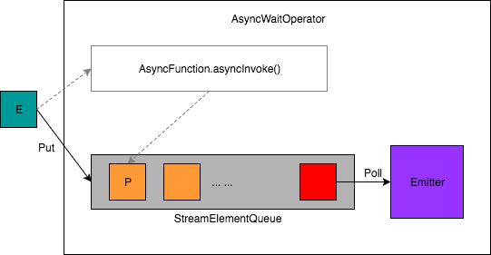

# 异步IO
异步调用相比于同步调用，不同请求的等待时间可以重叠，从而提升了吞吐率。
## Async I/O的使用方式
在Flink中使用Async I/O需要一个支持异步请求的客户端。以[官方链接](https://ci.apache.org/projects/flink/flink-docs-master/dev/stream/operators/asyncio.html)为例：
```scala
/**
 * An implementation of the 'AsyncFunction' that sends request and sets the callback.
 */
class AsyncDatabaseRequest extends AsyncFunction[String, (String, String)] {
    /** The database specific client that can issue concurrent requests with callbacks */
    lazy val client: DatabaseClient = new DatabaseClient(host, post, credentials)
    /** The context used for the future callbacks */
    implicit lazy val executor: ExecutionContext = ExecutionContext.fromExecutor(Executors.directExecutor())

    override def asyncInvoke(str: String, resultFuture: ResultFuture[(String, String)]): Unit = {
        // issue the asynchronous request, receive a future for the result
        // 发起异步请求，返回结果是一个Future
        val resultFutureRequested: Future[String] = client.query(str)
        // set the callback to be executed once the request by the client is complete
        // the callback simply forwards the result to the result future
        // 请求完成时的回调，将结果交给ResultFuture
        resultFutureRequested.onSuccess {
            case result: String => resultFuture.complete(Iterable((str, result)))
        }
    }
}

// create the original stream
val stream: DataStream[String] = ...
// 应用async I/O转换，设置等待模式、超时时间、以及进行中的异步请求的最大数量
val resultStream: DataStream[(String, String)] = 
    AsyncDataStream.unorderedWait(stream, new AsyncDatabaseRequest(), 1000, TimeUnit.MILLISECONDS, 100)
```
AsyncDataStream提供了两种调用方法，分别是orderedWait和unorderedWait，分别对应了有序和无序两种输出模式。之所以会提供两种输出模式，是因为异步请求的完成时间是不确定的，先发出的请求的完成时间可能会晚于后发出的请求。在“有序”的输出模式下，所有计算结果的提交完全和消息的到达顺序一致；而在“无序”的输出模式下，计算结果的提交则是和请求的完成顺序相关的，先处理完成的请求的计算结果会先提交。值得注意的是，在使用“事件时间”的情况下，“无序”输出模式仍然可以保证watermark的正常处理，即在两个watermark之间的消息的异步请求结果可能是异步提交的，但在watermark之后的消息不能先于该watermark之前的消息提交。

由于异步请求的完成时间不确定，需要设置请求的超时时间，并配置同时进行中的异步请求的最大数量。
## Async I/O的实现
AsyncDataStream在运行时被转换为AsyncWaitOperator算子，它是AbstractUdfStreamOperator的子类。下面看看AsyncWaitOperator的实现原理。
### 基本原理
AsyncWaitOperator算子相比于其他算子的最大不同在于，它的输入和输出并不是同步的。因此，在AsyncWaitOperator内部采用了一种“生产者-消费者”模型，基于一个队列解耦异步计算和计算结果的提交。StreamElementQueue提供了一种队列的抽象，一个“消费者”线程Emitter从中取出已完成的计算结果，并提交给下游算子，而异步请求则充当了队列“生产者”的角色。基本的处理逻辑如下图所示。

```java
public class AsyncWaitOperator<IN, OUT>
        extends AbstractUdfStreamOperator<OUT, AsyncFunction<IN, OUT>>
        implements OneInputStreamOperator<IN, OUT>, BoundedOneInput {
    /** Queue, into which to store the currently in-flight stream elements. */
    private transient StreamElementQueue<OUT> queue;

    public void processElement(StreamRecord<IN> element) throws Exception {
        // add element first to the queue
        final ResultFuture<OUT> entry = addToWorkQueue(element);

        final ResultHandler resultHandler = new ResultHandler(element, entry);

        // register a timeout for the entry if timeout is configured
        // 注册一个定时器，在超时时调用timeout方法
        if (timeout > 0L) {
            final long timeoutTimestamp = timeout + getProcessingTimeService().getCurrentProcessingTime();

            final ScheduledFuture<?> timeoutTimer = getProcessingTimeService().registerTimer(
                timeoutTimestamp,
                timestamp -> userFunction.timeout(element.getValue(), resultHandler));

            resultHandler.setTimeoutTimer(timeoutTimer);
        }

        userFunction.asyncInvoke(element.getValue(), resultHandler);
    }

    /**
     * Add the given stream element to the operator's stream element queue. This operation blocks until the element
     * has been added.
     *
     * <p>Between two insertion attempts, this method yields the execution to the mailbox, such that events as well
     * as asynchronous results can be processed.
     *
     * @param streamElement to add to the operator's queue
     * @throws InterruptedException if the current thread has been interrupted while yielding to mailbox
     * @return a handle that allows to set the result of the async computation for the given element.
     */
    private ResultFuture<OUT> addToWorkQueue(StreamElement streamElement) throws InterruptedException {

        Optional<ResultFuture<OUT>> queueEntry;
        while (!(queueEntry = queue.tryPut(streamElement)).isPresent()) {
            mailboxExecutor.yield();
        }

        return queueEntry.get();
    }

    /**
     * Outputs one completed element. Watermarks are always completed if it's their turn to be processed.
     *
     * <p>This method will be called from {@link #processWatermark(Watermark)} and from a mail processing the result
     * of an async function call.
     */
    private void outputCompletedElement() {
        if (queue.hasCompletedElements()) {
            // emit only one element to not block the mailbox thread unnecessarily
            queue.emitCompletedElement(timestampedCollector);
            // if there are more completed elements, emit them with subsequent mails
            if (queue.hasCompletedElements()) {
                mailboxExecutor.execute(this::outputCompletedElement, "AsyncWaitOperator#outputCompletedElement");
            }
        }
    }
}
```
AsyncWaitOperator可以工作在两种模式下，即ORDERED和UNORDERED。Flink通过StreamElementQueue的不同实现对应了这两种模式。
### “有序”模式
在“有序”模式下，所有异步请求的结果必须按照消息的到达顺序提交到下游算子。